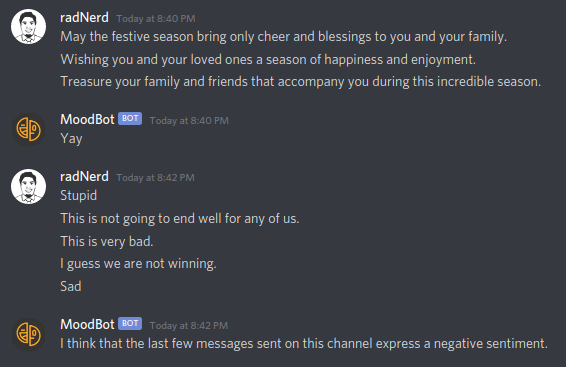

# MoodBot

Detects Sentiment from messages sent on any channel in a server and sends motivation if there have been 5 consecutive positive messages sent and a gentle reminder if the last few messages express a negative sentiment.

